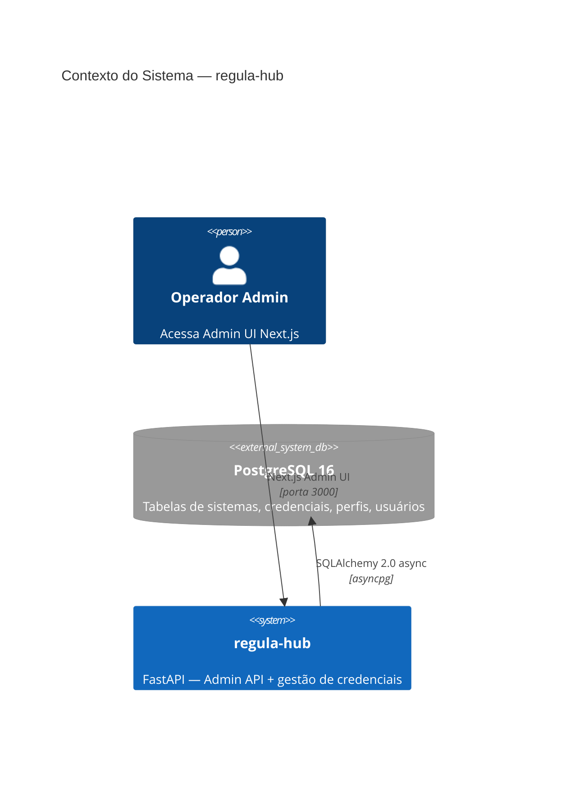
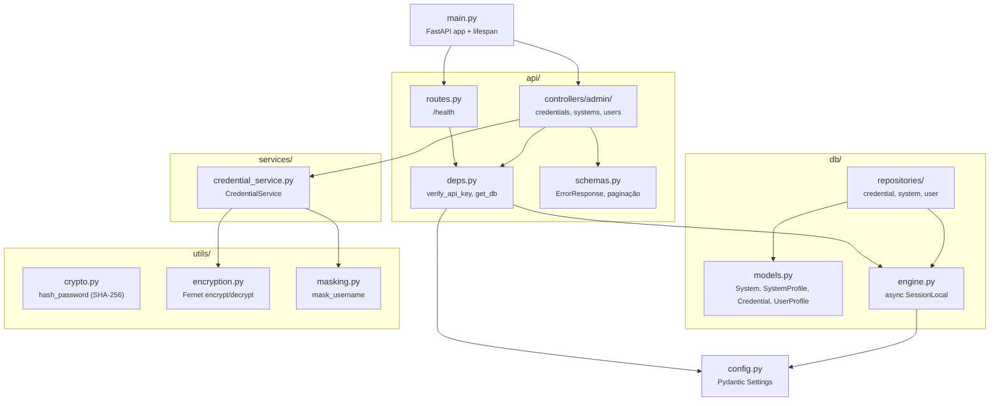
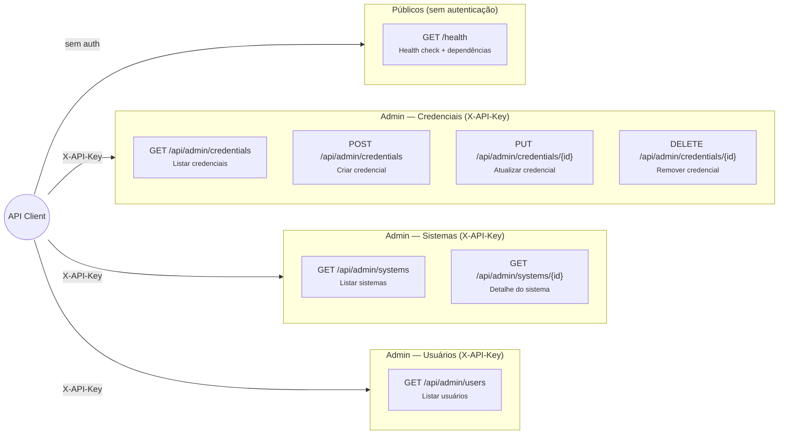
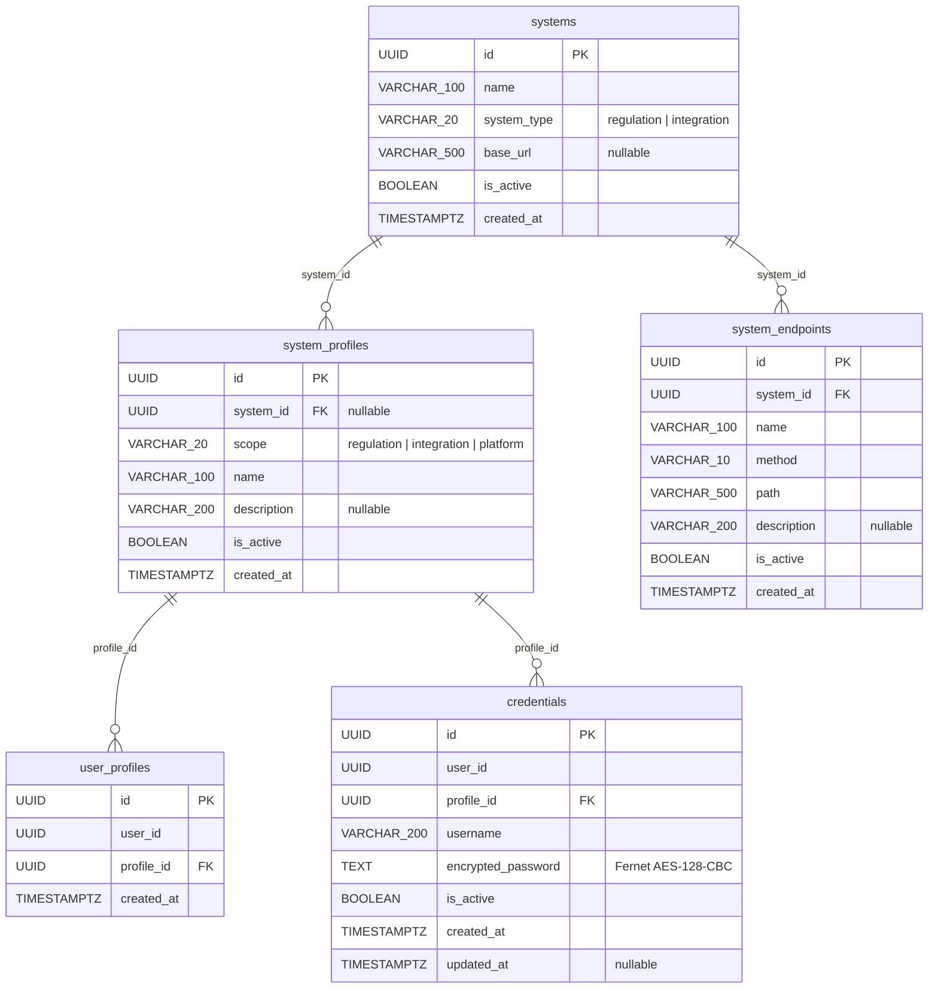
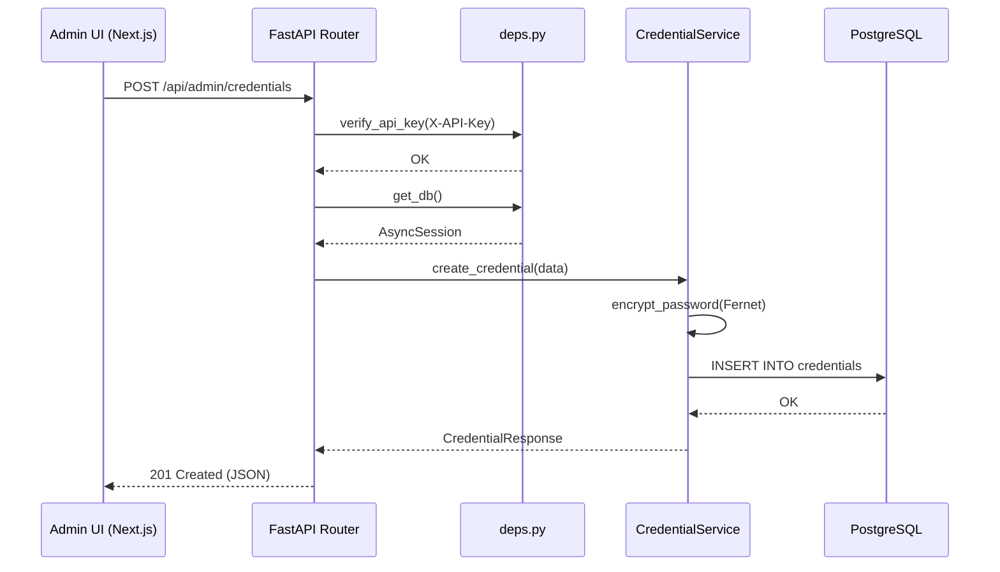

# Diagramas de Arquitetura — regula-hub

Documentação visual da arquitetura do serviço **regula-hub**, uma WebAPI FastAPI para gestão de credenciais e configuração de sistemas de regulação.

---

## 1. Diagrama de Contexto do Sistema

Visão de alto nível (estilo C4 Nível 1) mostrando o RegulaHub e seus sistemas externos.

---

## 2. Diagrama de Componentes Internos

Módulos do código-fonte e suas dependências.

---

## 3. Diagrama de Endpoints da API

Todos os endpoints organizados por controller, com método HTTP e autenticação.

---

## 4. Diagrama do Banco de Dados

Modelo entidade-relacionamento das tabelas de gestão (sistemas, credenciais, perfis, usuários).

**Constraints notáveis:**
- `system_profiles`: CHECK constraint — `scope = 'platform'` implica `system_id IS NULL`
- `credentials`: credenciais Fernet-encrypted por usuário por perfil de sistema
- Tabelas de referência SisReg (`sisreg_procedures`, `sisreg_departments`, `sisreg_department_execution_mapping`) são criadas por scripts Docker init

---

## 5. Diagrama de Fluxo de Requisição

Ciclo de vida de uma requisição à Admin API (exemplo: criação de credencial).

---

## Legenda

| Símbolo | Significado |
|---------|-------------|
| Linha sólida (`→`) | Dependência direta / chamada |
| `PK` | Chave primária |
| `FK` | Chave estrangeira |
| Tabelas gerenciadas | Criadas/migradas via Alembic |
| Tabelas de referência `sisreg_*` | Criadas por scripts Docker init (seed data) |
